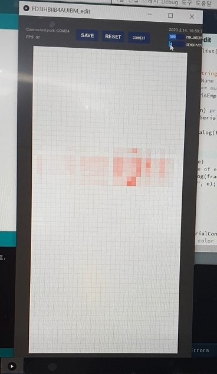

# SmartMat-32x64-ino-java-

## introduction

* **MatProgram** : data visualization program in processing with java
* **arduino** : arduino program with c++
* **arduino_dump** : arduino program creating dump data for test
* **o-matArduino** : ref file,

## Get started
1. run arduino/arduino.ino
2. run MatProgram/MatProgram.pde

## img

